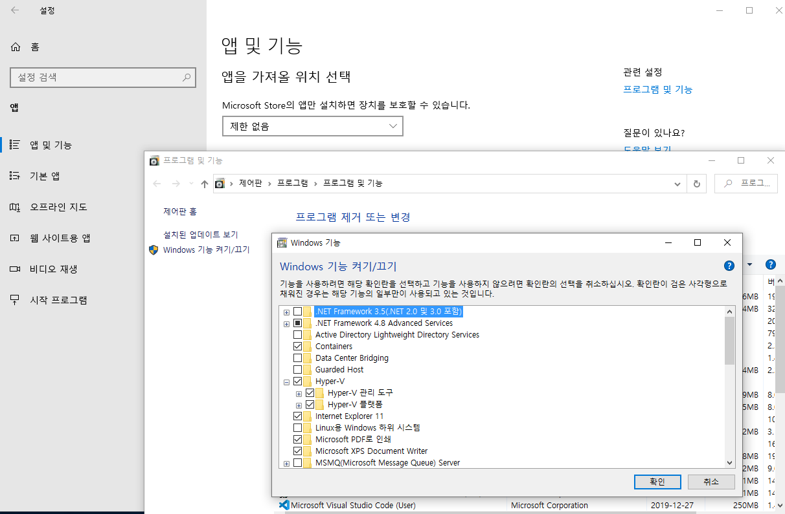
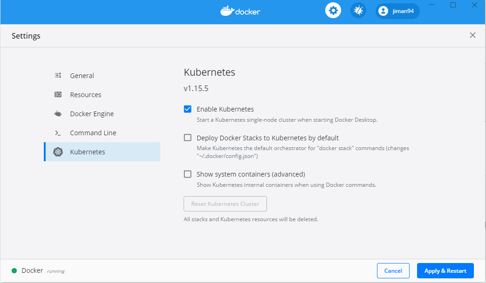
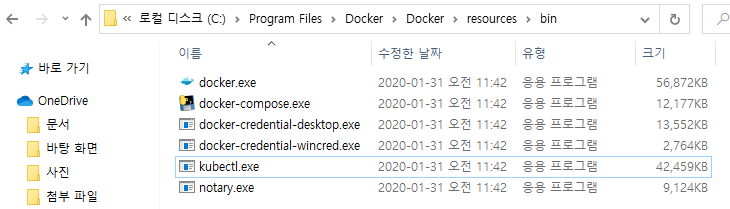
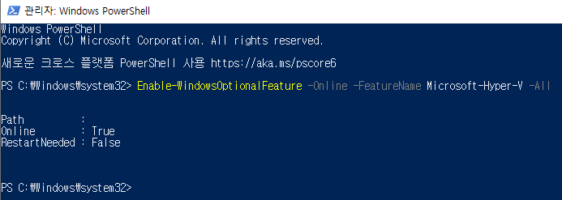
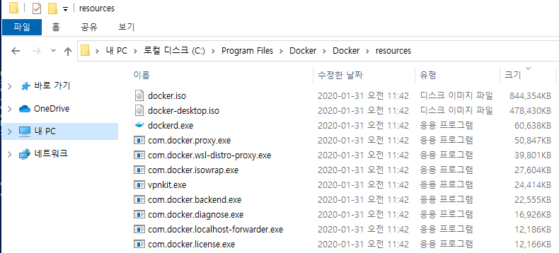
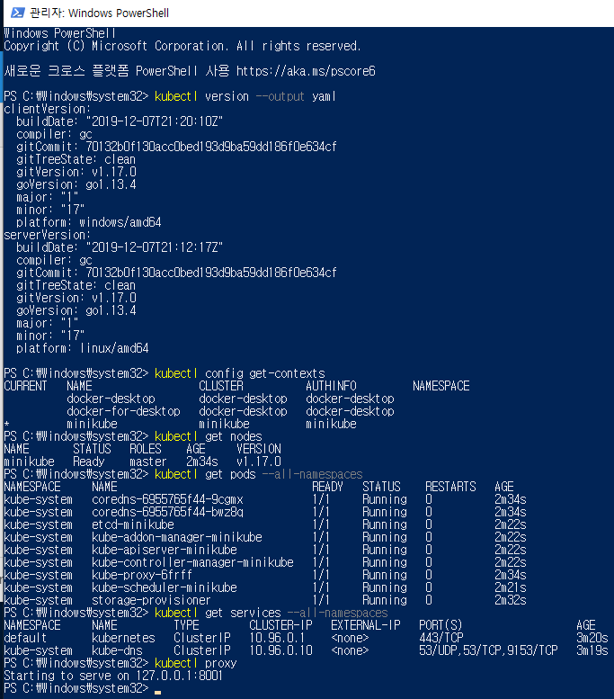
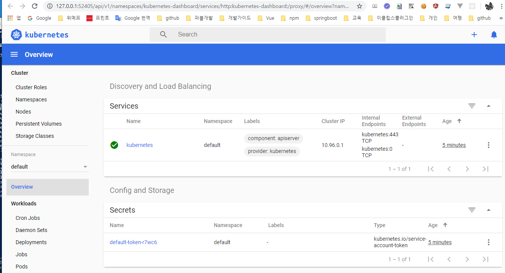

# Docker & Kubernetes
```yaml

C:\Program Files\Docker\Docker\resources\bin
D:\Project\tools
C:\ProgramData\chocolatey\bin
C:\Program Files\Kubernetes\Minikube
C:\Program Files\TortoiseGit\bin
```

### 1. Enabling Hyper-V











### 2. Open a PowerShell console as Administrator 

```yaml
PS C:\WINDOWS\system32> Enable-WindowsOptionalFeature -Online -FeatureName Microsoft-Hyper-V -All

Path          :
Online        : True
RestartNeeded : False
```

### 3. minikube start --vm-driver=hyperv 

```yaml
PS C:\WINDOWS\system32> minikube start --vm-driver=hyperv
* minikube v1.6.2 on Microsoft Windows 10 Pro 10.0.17763 Build 17763
* Selecting 'hyperv' driver from user configuration (alternates: [])
* Downloading VM boot image ...
    > minikube-v1.6.0.iso.sha256: 65 B / 65 B [--------------] 100.00% ? p/s 0s
    > minikube-v1.6.0.iso: 150.93 MiB / 150.93 MiB [-] 100.00% 5.01 MiB p/s 30s
* Creating hyperv VM (CPUs=2, Memory=2000MB, Disk=20000MB) ...
* Preparing Kubernetes v1.17.0 on Docker '19.03.5' ...
* Downloading kubeadm v1.17.0
* Downloading kubelet v1.17.0
* Pulling images ...
* Launching Kubernetes ...
* Waiting for cluster to come online ...
* Done! kubectl is now configured to use "minikube"
! C:\Program Files\Docker\Docker\resources\bin\kubectl.exe is version 1.15.5, and is incompatible with Kubernetes 1.17.0. You will need to update C:\Program Files\Docker\Docker\resources\bin\kubectl.exe or use 'minikube kubectl' to connect with this cluster
PS C:\WINDOWS\system32>
```

### 4. kubectl config use-context minikube

```yaml
PS C:\WINDOWS\system32> kubectl config use-context minikube
Switched to context "minikube".

PS C:\WINDOWS\system32> kubectl get pods --context=minikube
No resources found.
```

### 5. minikube dashboard

```yaml
PS C:\WINDOWS\system32> minikube dashboard
* Verifying dashboard health ...
* Launching proxy ...
* Verifying proxy health ...
* Opening http://127.0.0.1:51980/api/v1/namespaces/kubernetes-dashboard/services/http:kubernetes-dashboard:/proxy/ in your default browser...
```

### 6.  kubectl version --output yaml
```yaml
PS C:\Windows\system32> kubectl version --output yaml
clientVersion:
  buildDate: "2019-12-07T21:20:10Z"
  compiler: gc
  gitCommit: 70132b0f130acc0bed193d9ba59dd186f0e634cf
  gitTreeState: clean
  gitVersion: v1.17.0
  goVersion: go1.13.4
  major: "1"
  minor: "17"
  platform: windows/amd64
serverVersion:
  buildDate: "2019-12-07T21:12:17Z"
  compiler: gc
  gitCommit: 70132b0f130acc0bed193d9ba59dd186f0e634cf
  gitTreeState: clean
  gitVersion: v1.17.0
  goVersion: go1.13.4
  major: "1"
  minor: "17"
  platform: linux/amd64
```

### 7. kubectl config get-contexts
```yaml
PS C:\Windows\system32> kubectl config get-contexts
CURRENT   NAME                 CLUSTER          AUTHINFO         NAMESPACE
          docker-desktop       docker-desktop   docker-desktop
          docker-for-desktop   docker-desktop   docker-desktop
*         minikube             minikube         minikube
*         
```

### 8.  kubectl get nodes

```yaml
PS C:\Windows\system32> kubectl get nodes
NAME       STATUS   ROLES    AGE     VERSION
minikube   Ready    master   2m34s   v1.17.0
```

### 9.  kubectl get pods --all-namespaces

```yaml
PS C:\Windows\system32> kubectl get pods --all-namespaces
NAMESPACE     NAME                               READY   STATUS    RESTARTS   AGE
kube-system   coredns-6955765f44-9cgmx           1/1     Running   0          2m34s
kube-system   coredns-6955765f44-bwz8q           1/1     Running   0          2m34s
kube-system   etcd-minikube                      1/1     Running   0          2m22s
kube-system   kube-addon-manager-minikube        1/1     Running   0          2m22s
kube-system   kube-apiserver-minikube            1/1     Running   0          2m22s
kube-system   kube-controller-manager-minikube   1/1     Running   0          2m22s
kube-system   kube-proxy-6frff                   1/1     Running   0          2m34s
kube-system   kube-scheduler-minikube            1/1     Running   0          2m21s
kube-system   storage-provisioner                1/1     Running   0          2m32s
```
### 10. kubectl get services --all-namespaces

```yaml
PS C:\Windows\system32> kubectl get services --all-namespaces
NAMESPACE     NAME         TYPE        CLUSTER-IP   EXTERNAL-IP   PORT(S)                  AGE
default       kubernetes   ClusterIP   10.96.0.1    <none>        443/TCP                  3m20s
kube-system   kube-dns     ClusterIP   10.96.0.10   <none>        53/UDP,53/TCP,9153/TCP   3m19s
```
### 11.  kubectl cluster-info
```yaml
PS C:\Windows\system32>  kubectl cluster-info
Kubernetes master is running at https://172.17.161.107:8443
KubeDNS is running at https://172.17.161.107:8443/api/v1/namespaces/kube-system/services/kube-dns:dns/proxy

To further debug and diagnose cluster problems, use 'kubectl cluster-info dump'.
PS C:\Windows\system32>
```


### Quickstart

```yaml
PS C:\WINDOWS\system32> kubectl create deployment hello-minikube --image=k8s.gcr.io/echoserver:1.10
deployment.apps/hello-minikube created
```

### 


```yaml
PS C:\WINDOWS\system32> kubectl expose deployment hello-minikube --type=NodePort --port=8080
service/hello-minikube exposed
```

### 

```yaml
PS C:\WINDOWS\system32> kubectl get pod
NAME                              READY   STATUS    RESTARTS   AGE
hello-minikube-797f975945-z526f   1/1     Running   0          48s
```

### 

```yaml
PS C:\WINDOWS\system32> minikube service hello-minikube --url
http://172.18.64.250:30339
PS C:\WINDOWS\system32>
```
### 

```yaml
PS C:\WINDOWS\system32> kubectl delete services hello-minikube
service "hello-minikube" deleted
```
### 

```yaml
PS C:\WINDOWS\system32> kubectl delete deployment hello-minikube
deployment.apps "hello-minikube" deleted
```
### 

```yaml
PS C:\WINDOWS\system32> minikube stop
* Stopping "minikube" in hyperv ...
* Powering off "minikube" via SSH ...
* "minikube" stopped.
```
### 

```yaml
PS C:\WINDOWS\system32> minikube delete
* Successfully powered off Hyper-V. minikube driver -- hyperv
* Deleting "minikube" in hyperv ...
* The "minikube" cluster has been deleted.
* Successfully deleted profile "minikube"
PS C:\WINDOWS\system32>
```


### 

```yaml
Set-ExecutionPolicy Bypass -Scope Process -Force; iex ((New-Object System.Net.WebClient).DownloadString('https://chocolatey.org/install.ps1'))
```
### 

```yaml
https://github.com/kubernetes/minikube/releases/tag/v1.6.2
```

### 

```yaml
https://minikube.sigs.k8s.io/docs/reference/drivers/hyperv/
```

### 
```yaml
C:\Users\PC_이름\.docker 디렉토리를 삭제

powershell [Environment]::SetEnvironmentVariable('DOCKER_CERT_PATH', $null, 'User')
powershell [Environment]::SetEnvironmentVariable('DOCKER_HOST', $null, 'User')
powershell [Environment]::SetEnvironmentVariable('DOCKER_MACHINE_NAME', $null, 'User')
powershell [Environment]::SetEnvironmentVariable('DOCKER_TLS_VERIFY', $null, 'User')
powershell [Environment]::SetEnvironmentVariable('DOCKER_TOOLBOX_INSTALL_PATH', $null, 'User')
```yaml
