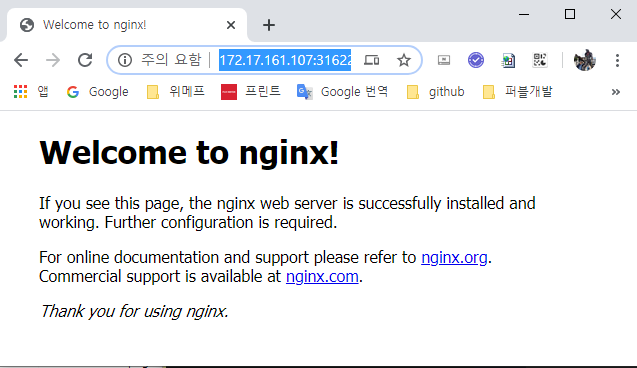

# NodePort :: nginx 

### 1. kubectl cluster-info

```yaml 
PS C:\Windows\system32>  kubectl cluster-info
Kubernetes master is running at https://172.17.161.107:8443
KubeDNS is running at https://172.17.161.107:8443/api/v1/namespaces/kube-system/services/kube-dns:dns/proxy

To further debug and diagnose cluster problems, use 'kubectl cluster-info dump'.
```

### 2. minikube ip

```yaml 
PS C:\Windows\system32> minikube ip
172.17.161.107
```

### 3. kubectl run nginx
```yaml 
PS C:\Windows\system32> kubectl run nginx --image nginx --port=80
kubectl run --generator=deployment/apps.v1 is DEPRECATED and will be removed in a future version. Use kubectl run --generator=run-pod/v1 or kubectl create instead.
deployment.apps/nginx created
```

### 4. kubectl get pods
```yaml 
PS C:\Windows\system32> kubectl get pods
NAME                     READY   STATUS              RESTARTS   AGE
nginx-5578584966-fkfww   0/1     ContainerCreating   0          8s
```

### 5. NodePort

```yaml 
PS C:\Windows\system32> kubectl expose deployment nginx --type=NodePort
service/nginx exposed
```

### 6. kubectl get pods
```yaml 
PS C:\Windows\system32> kubectl get pods
NAME                     READY   STATUS    RESTARTS   AGE
nginx-5578584966-fkfww   1/1     Running   0          28s
```

### 7. kubectl get deploy

```yaml 
PS C:\Windows\system32> kubectl get deploy
NAME    READY   UP-TO-DATE   AVAILABLE   AGE
nginx   1/1     1            1           45s
```

### 8. kubectl get service

```yaml 
PS C:\Windows\system32> kubectl get service
NAME         TYPE        CLUSTER-IP     EXTERNAL-IP   PORT(S)        AGE
kubernetes   ClusterIP   10.96.0.1      <none>        443/TCP        25m
nginx        NodePort    10.96.15.236   <none>        80:31622/TCP   50s
```

### 9. kubectl describe service nginx
```yaml 
PS C:\Windows\system32> kubectl describe service nginx
Name:                     nginx
Namespace:                default
Labels:                   run=nginx
Annotations:              <none>
Selector:                 run=nginx
Type:                     NodePort
IP:                       10.96.15.236
Port:                     <unset>  80/TCP
TargetPort:               80/TCP
NodePort:                 <unset>  31622/TCP
Endpoints:                172.18.0.6:80
Session Affinity:         None
External Traffic Policy:  Cluster
Events:                   <none>
PS C:\Windows\system32>
```

### 10. nginx 메인 페이지 호출 

```yaml 
http://172.17.161.107:31622/
```




### 11. kubectl delete deploymene nginx


### 12. kubectl delete service nginx-app
