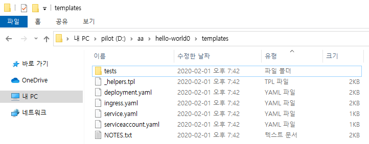

# Helm
> Helm은 Kubernetes 애플리케이션을 설치하고 수명 주기를 관리하는 오픈 소스 패키징 도구입니다

C:\Users\jiman\AppData\Roaming\helm


helm repo add stable https://kubernetes-charts.storage.googleapis.com/

helm search repo stable

helm repo update

helm install my-nginx-ingress stable/nginx-ingress

kubectl --namespace default get services -o wide -w my-nginx-ingress-controller

minikube service hello-minikube --url


### kubectl get namespace

```yaml 
PS D:\> kubectl get namespace
NAME                   STATUS   AGE
default                Active   31h
kube-node-lease        Active   31h
kube-public            Active   31h
kube-system            Active   31h
kubernetes-dashboard   Active   31h
PS D:\>
```

### helm install my-nginx-ingress stable/nginx-ingress
```yaml 
PS D:\> helm install my-nginx-ingress stable/nginx-ingress
NAME: my-nginx-ingress
LAST DEPLOYED: Sat Feb  1 19:22:59 2020
NAMESPACE: default
STATUS: deployed
REVISION: 1
TEST SUITE: None
NOTES:
The nginx-ingress controller has been installed.
It may take a few minutes for the LoadBalancer IP to be available.
You can watch the status by running 'kubectl --namespace default get services -o wide -w my-nginx-ingress-controller'

An example Ingress that makes use of the controller:

  apiVersion: extensions/v1beta1
  kind: Ingress
  metadata:
    annotations:
      kubernetes.io/ingress.class: nginx
    name: example
    namespace: foo
  spec:
    rules:
      - host: www.example.com
        http:
          paths:
            - backend:
                serviceName: exampleService
                servicePort: 80
              path: /
    # This section is only required if TLS is to be enabled for the Ingress
    tls:
        - hosts:
            - www.example.com
          secretName: example-tls

If TLS is enabled for the Ingress, a Secret containing the certificate and key must also be provided:

  apiVersion: v1
  kind: Secret
  metadata:
    name: example-tls
    namespace: foo
  data:
    tls.crt: <base64 encoded cert>
    tls.key: <base64 encoded key>
  type: kubernetes.io/tls
PS D:\>
```

### minikube start --vm-driver=hyperv
```yaml 
PS C:\Windows\system32> minikube start --vm-driver=hyperv
* minikube v1.6.2 on Microsoft Windows 10 Pro 10.0.18363 Build 18363
* Selecting 'hyperv' driver from user configuration (alternates: [virtualbox])
* Tip: Use 'minikube start -p <name>' to create a new cluster, or 'minikube delete' to delete this one.
* Using the running hyperv "minikube" VM ...
* Waiting for the host to be provisioned ...
* Preparing Kubernetes v1.17.0 on Docker '19.03.5' ...
* Launching Kubernetes ...
* Done! kubectl is now configured to use "minikube"
PS C:\Windows\system32>
PS C:\Windows\system32>
PS C:\Windows\system32>
PS C:\Windows\system32> helm list
NAME                    NAMESPACE       REVISION        UPDATED                                 STATUS          CHART                   APP VERSION
my-nginx-ingress        default         1               2020-02-01 19:22:59.1515413 +0900 KST   deployed        nginx-ingress-1.29.6    0.28.0
PS C:\Windows\system32>
```


### kubectl describe pod/my-nginx-ingress-default-backend-596678dfbf-vsx92
```yaml 
 PS C:\Windows\system32> kubectl describe pod/my-nginx-ingress-default-backend-596678dfbf-vsx92

Name:         my-nginx-ingress-default-backend-596678dfbf-vsx92
Namespace:    default
Priority:     0
Node:         minikube/192.168.126.244
Start Time:   Sat, 01 Feb 2020 19:23:00 +0900
Labels:       app=nginx-ingress
              component=default-backend
              pod-template-hash=596678dfbf
              release=my-nginx-ingress
Annotations:  <none>
Status:       Running
IP:           172.18.0.8
IPs:
  IP:           172.18.0.8
Controlled By:  ReplicaSet/my-nginx-ingress-default-backend-596678dfbf
Containers:
  nginx-ingress-default-backend:
    Container ID:   docker://842dc1a5c58b7d76ba1876c7b6dcd1aab2f15a8cb077628876187e14cbeca5f0
    Image:          k8s.gcr.io/defaultbackend-amd64:1.5
    Image ID:       docker-pullable://k8s.gcr.io/defaultbackend-amd64@sha256:4dc5e07c8ca4e23bddb3153737d7b8c556e5fb2f29c4558b7cd6e6df99c512c7
    Port:           8080/TCP
    Host Port:      0/TCP
    State:          Running
      Started:      Sat, 01 Feb 2020 19:23:20 +0900
    Ready:          True
    Restart Count:  0
    Liveness:       http-get http://:8080/healthz delay=30s timeout=5s period=10s #success=1 #failure=3
    Readiness:      http-get http://:8080/healthz delay=0s timeout=5s period=5s #success=1 #failure=6
    Environment:    <none>
    Mounts:
      /var/run/secrets/kubernetes.io/serviceaccount from my-nginx-ingress-backend-token-lhw8z (ro)
Conditions:
  Type              Status
  Initialized       True
  Ready             True
  ContainersReady   True
  PodScheduled      True
Volumes:
  my-nginx-ingress-backend-token-lhw8z:
    Type:        Secret (a volume populated by a Secret)
    SecretName:  my-nginx-ingress-backend-token-lhw8z
    Optional:    false
QoS Class:       BestEffort
Node-Selectors:  <none>
Tolerations:     node.kubernetes.io/not-ready:NoExecute for 300s
                 node.kubernetes.io/unreachable:NoExecute for 300s
Events:
  Type    Reason     Age    From               Message
  ----    ------     ----   ----               -------
  Normal  Scheduled  3m16s  default-scheduler  Successfully assigned default/my-nginx-ingress-default-backend-596678dfbf-vsx92 to minikube
  Normal  Pulling    3m15s  kubelet, minikube  Pulling image "k8s.gcr.io/defaultbackend-amd64:1.5"
  Normal  Pulled     2m56s  kubelet, minikube  Successfully pulled image "k8s.gcr.io/defaultbackend-amd64:1.5"
  Normal  Created    2m56s  kubelet, minikube  Created container nginx-ingress-default-backend
  Normal  Started    2m56s  kubelet, minikube  Started container nginx-ingress-default-backend
```
###  kubectl get services --all-namespaces

```yaml 
PS C:\Windows\system32> kubectl get services --all-namespaces
NAMESPACE              NAME                               TYPE           CLUSTER-IP      EXTERNAL-IP   PORT(S)                      AGE
default                kubernetes                         ClusterIP      10.96.0.1       <none>        443/TCP                      31h
default                my-nginx-ingress-controller        LoadBalancer   10.96.245.234   <pending>     80:31027/TCP,443:32437/TCP   4m3s
default                my-nginx-ingress-default-backend   ClusterIP      10.96.215.176   <none>        80/TCP                       4m3s
default                nginx                              NodePort       10.96.15.236    <none>        80:31622/TCP                 31h
kube-system            kube-dns                           ClusterIP      10.96.0.10      <none>        53/UDP,53/TCP,9153/TCP       31h
kubernetes-dashboard   dashboard-metrics-scraper          ClusterIP      10.96.127.44    <none>        8000/TCP                     31h
kubernetes-dashboard   kubernetes-dashboard               ClusterIP      10.96.232.209   <none>        80/TCP                       31h
PS C:\Windows\system32> kubectl expose deploy
error: resource(s) were provided, but no name, label selector, or --all flag specified
See 'kubectl expose -h' for help and examples
```

### minikube service my-nginx-ingress-controller  --url
```yaml 
PS C:\Windows\system32> minikube service my-nginx-ingress-controller  --url
http://192.168.126.244:31027
http://192.168.126.244:32437
PS C:\Windows\system32>
```

### kubectl --namespace default get services -o wide -w 
```yaml 
PS D:\>  kubectl --namespace default get services -o wide -w my-nginx-ingress-controller
NAME                          TYPE           CLUSTER-IP      EXTERNAL-IP   PORT(S)                      AGE   SELECTOR
my-nginx-ingress-controller   LoadBalancer   10.96.245.234   <pending>     80:31027/TCP,443:32437/TCP   38s   app=nginx-ingress,component=controller,release=my-nginx-ingress
```

```yaml 
PS D:\2019\kubernetes-ingress\deployments\helm-chart> kubectl get services --all-namespaces
NAMESPACE              NAME                               TYPE           CLUSTER-IP      EXTERNAL-IP   PORT(S)                      AGE
default                kubernetes                         ClusterIP      10.96.0.1       <none>        443/TCP                      32h
default                my-nginx-ingress-controller        LoadBalancer   10.96.245.234   <pending>     80:31027/TCP,443:32437/TCP   51m
default                my-nginx-ingress-default-backend   ClusterIP      10.96.215.176   <none>        80/TCP                       51m
default                my-release-nginx-ingress           LoadBalancer   10.96.136.200   <pending>     80:30779/TCP,443:32514/TCP   3m3s
default                nginx                              NodePort       10.96.15.236    <none>        80:31622/TCP                 31h
kube-system            kube-dns                           ClusterIP      10.96.0.10      <none>        53/UDP,53/TCP,9153/TCP       32h
kubernetes-dashboard   dashboard-metrics-scraper          ClusterIP      10.96.127.44    <none>        8000/TCP                     32h
kubernetes-dashboard   kubernetes-dashboard               ClusterIP      10.96.232.209   <none>        80/TCP                       32h
```

```yaml 
PS D:\2019\kubernetes-ingress\deployments\helm-chart> minikube service my-release-nginx-ingress --url
http://192.168.126.244:30779
http://192.168.126.244:32514
PS D:\2019\kubernetes-ingress\deployments\helm-chart>
```

```yaml
PS D:\>  helm repo update
Hang tight while we grab the latest from your chart repositories...
...Successfully got an update from the "stable" chart repository
Update Complete. ⎈ Happy Helming!⎈
```

```yaml 

PS D:\> helm search repo stable
```


https://github.com/nginxinc/kubernetes-ingress.git


cd kubernetes-ingress/helm-chart
helm install my-release . --set controller.replicaCount=5

---
choco install kubernetes-helm

kubectl cluster-info

helm init

helm create hello-world



helm lint ./hello-world

helm template ./hello-world


# Source:

hello-world/Chart.yaml
hello-world/values.yaml
hello-world/templates/service.yaml
hello-world/templates/deployment.yaml
hello-world/templates/serviceaccount.yaml
hello-world/templates/ingress.yaml
hello-world/templates/service.yaml


helm install --name hello-world ./hello-world

helm upgrade hello-world ./hello-world

helm rollback hello-world 1

helm delete --purge hello-world

helm package ./hello-world

helm repo index my-repo/ --url https://<username>.github.io/my-repo

helm repo add my-repo https://my-pages.github.io/my-repo

helm install my-repo/hello-world --name=hello-world